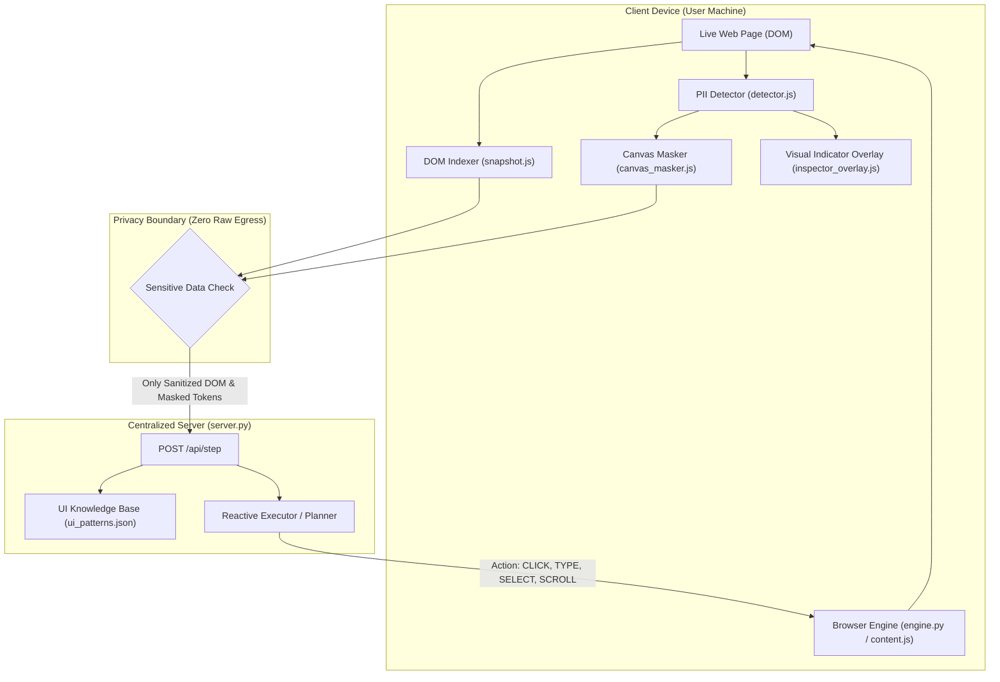
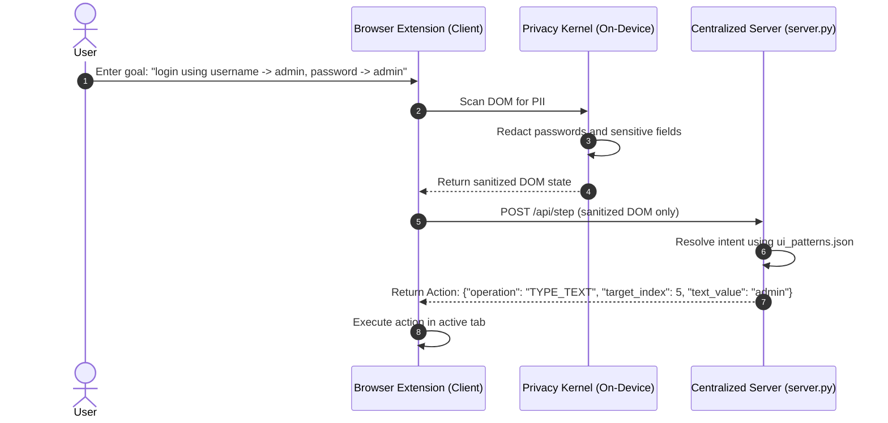

# LiteSight: Architecture Specification

Language: Simplified Technical English (STE)

This document describes the system architecture for LiteSight. LiteSight is a privacy-preserving browser agent built for the Smart India Hackathon (SIH).

---

## 1. High-Level Design

The architecture contains two primary systems:
1. **Client Device (Browser Extension or CLI Agent)**: Runs on the local user machine. It reads the screen, indexes interactive DOM elements, and redacts Personally Identifiable Information (PII) before any network transmission.
2. **Centralized Reasoning Server (`server.py`)**: Receives only sanitized and anonymized data. It determines the next action and returns structured commands (`CLICK`, `TYPE_TEXT`, `SELECT`, `SCROLL_DOWN`) for the client to execute.



---

## 2. Component Specifications

### A. Client Perception & DOM Indexing (`src/state/snapshot.js`)
- The client extracts all visible, interactive DOM elements.
- Each element receives an integer index (`[0]`, `[1]`, `[2]`), accessible ARIA role, HTML tag, and screen bounding box (`x, y, width, height`).
- Associated form labels are extracted via four fallback strategies:
  1. Native `label[for="id"]` mapping.
  2. Direct `el.labels` collection.
  3. Parent wrapping `<label>` text.
  4. Sibling element text within the same input group.

### B. On-Device Privacy Layer (`src/privacy/`)
All DOM text and screen frames must pass through the on-device privacy layer before transmission:
- **Detector (`src/privacy/detector.js`)**:
  - Scans DOM inputs, leaf text nodes, and visual regions for sensitive data.
  - Supports 6 PII categories:
    1. `credit_cards`: 13 to 19 digit numbers with Luhn checksum validation.
    2. `passwords`: Password fields, secret tokens, API keys.
    3. `emails`: RFC 5322 email patterns.
    4. `names`: Full names and labeled person name fields.
    5. `phone_numbers`: International (E.164) and domestic phone formats.
    6. `government_ids`: SSN and government identification numbers.
  - Supports 3 sensitivity tiers:
    - `Strict`: Flags all potential matches and high-entropy numeric identifiers.
    - `Balanced` (Default): Combines structural attributes with regex patterns.
    - `Relaxed`: Flags only confirmed credentials and financial cards.
- **Visual Indicators (`src/privacy/inspector_overlay.js`)**:
  - `👁️ MONITORED: [CATEGORY]`: Cyan dashed border on sensitive inputs under active observation.
  - `🛡️ REDACTED: [CATEGORY]`: Emerald green border on inputs containing redacted data.
  - Overlays use `pointer-events: none` on bounding boxes so user interactions are not blocked.
- **Canvas Masker (`src/privacy/canvas_masker.js`)**:
  - Draws synthetic vector boxes over sensitive pixels before image tokens leave the device.
  - Replaces text with tokens such as `[REDACTED_PASSWORD]` or `[REDACTED_CREDIT_CARD]`.

### C. Fast-Path Action Policy (`src/orchestrator/executor.py`)
- Standard web actions execute in under 500ms using learned UI invariants ([`src/knowledge/ui_patterns.json`](src/knowledge/ui_patterns.json)).
- The engine computes a match score for each candidate element:
  $$\text{Score} = \text{Base Weight} + (4.0 \times \text{Keyword Match}) + (3.0 \times \text{Role Match}) + (2.0 \times \text{Tag Match})$$
- Elements are verified against intent guards:
  - Text actions (`TYPE_TEXT`, `TYPE_AND_SUBMIT`) target editable inputs only.
  - Selection actions (`SELECT`) target `<select>`, `combobox`, or `listbox` elements.
  - If a filter is not visible on screen, the engine returns `SCROLL_DOWN` instead of clicking unrelated links.

### D. Centralized Reasoning Server (`server.py`)
The server provides centralized reasoning via REST endpoints:
- `POST /api/step`: Receives sanitized DOM elements and the current subgoal. Returns the next action command.
- `POST /api/sanitize`: Sanitizes raw input text and returns redacted tokens.
- `GET /api/settings`: Returns active sensitivity levels and enabled PII categories.
- `POST /api/settings`: Updates sensitivity and category settings at runtime.
- `GET /health`: Returns service health status and privacy audit flags.

### E. Visual Fallback Engine (`src/vision/`)
When the DOM is empty or elements reside in Canvas/WebGL:
- **OmniVisualParser (`src/vision/omni_parser.py`)**: Uses morphological edge detection and Non-Maximum Suppression (NMS) to detect interactive elements directly from pixel arrays.
- **FoveatedTokenizer (`src/vision/foveation.py`)**: Extracts a high-resolution crop around the target coordinate and downsamples the surrounding area, reducing visual tokens by 24x.

---

## 3. Data Flow & Communication



---

## 4. Machine Data Schemas

### A. Indexed DOM Snapshot Schema (`src/state/snapshot.js`)

```json
{
  "$schema": "http://json-schema.org/draft-07/schema#",
  "type": "object",
  "properties": {
    "timestamp": { "type": "number" },
    "url": { "type": "string" },
    "elements": {
      "type": "array",
      "items": {
        "type": "object",
        "properties": {
          "index": { "type": "integer" },
          "tag": { "type": "string" },
          "role": { "type": "string" },
          "label": { "type": "string" },
          "value": { "type": "string" },
          "is_visible": { "type": "boolean" },
          "bounding_box": {
            "type": "object",
            "properties": {
              "x": { "type": "number" },
              "y": { "type": "number" },
              "width": { "type": "number" },
              "height": { "type": "number" }
            },
            "required": ["x", "y", "width", "height"]
          }
        },
        "required": ["index", "tag", "is_visible", "bounding_box"]
      }
    }
  },
  "required": ["timestamp", "url", "elements"]
}
```

### B. Server Action Command Schema (`server.py`)

```json
{
  "$schema": "http://json-schema.org/draft-07/schema#",
  "type": "object",
  "properties": {
    "operation": {
      "type": "string",
      "enum": ["CLICK", "TYPE_TEXT", "TYPE_AND_SUBMIT", "SELECT", "SCROLL_UP", "SCROLL_DOWN", "WAIT", "EXTRACT_AND_ANSWER", "DONE"]
    },
    "target_index": { "type": ["integer", "null"] },
    "target_label": { "type": ["string", "null"] },
    "text_value": { "type": ["string", "null"] },
    "reasoning_summary": { "type": "string" }
  },
  "required": ["operation", "target_index"]
}
```

### C. Privacy Configuration Schema (`src/state/sanitizer.py`, `server.py`)

```json
{
  "$schema": "http://json-schema.org/draft-07/schema#",
  "type": "object",
  "properties": {
    "sensitivity": {
      "type": "string",
      "enum": ["strict", "balanced", "relaxed"]
    },
    "categories": {
      "type": "object",
      "properties": {
        "credit_cards": { "type": "boolean" },
        "passwords": { "type": "boolean" },
        "emails": { "type": "boolean" },
        "names": { "type": "boolean" },
        "phone_numbers": { "type": "boolean" },
        "government_ids": { "type": "boolean" }
      }
    },
    "visual_indicators": { "type": "boolean" }
  },
  "required": ["sensitivity", "categories"]
}
```

---

## 5. Error Handling & Custom Exceptions

Modules raise custom exceptions from [`src/orchestrator/exceptions.py`](src/orchestrator/exceptions.py):

| Exception | Cause | System Response |
| :--- | :--- | :--- |
| `PIIRedactionFailure` | Privacy kernel detects unmasked sensitive data | Aborts network transmission immediately. |
| `StaleNodeException` | Target index no longer exists in DOM | Triggers fresh DOM snapshot and re-evaluates. |
| `ElementObscuredError` | Target element is covered by modal or zero-width | Closes modal overlay or scrolls element into view. |
| `CanvasFallbackTrigger` | Target element is inside `<canvas>` or WebGL | Diverts to OmniParser visual coordinate fallback. |

---

## 6. Security Invariants

1. **Zero Raw Egress**: Raw passwords, card numbers, and full-resolution unredacted frames never cross network boundaries.
2. **Safe DOM Text Extraction**: The DOM scanner uses `textContent` instead of `innerText` to prevent synchronous reflows and layout freezing.
3. **Escaped Selectors**: Dynamic DOM queries use `CSS.escape(String(index))` to prevent selector injection attacks.
4. **Bounded Request Body**: The server enforces a 10 MB payload limit (`MAX_PAYLOAD_BYTES`) and returns HTTP 413 for oversized requests.
5. **URL Protocol Restriction**: Only `http://` and `https://` schemes are accepted. Protocols like `file://` and `javascript:` are rejected.
6. **Task Reference Tracking**: Asynchronous background tasks are retained in explicit reference sets to avoid garbage collection errors during execution.